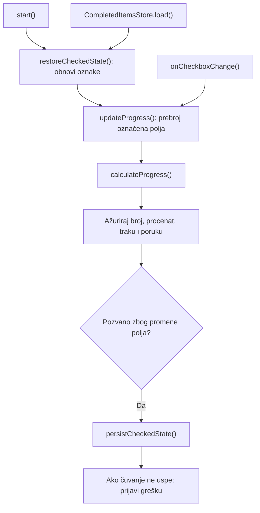

# Izveštaj o povezivanju trake progresa

## 1. Stanje pre izmene

Stranica je imala osam polja za potvrdu, podeljenih u tri grupe. Klasa
`InterviewPreparationPage` u `src/main.ts` pronalazila je polja, proveravala
njihov broj i obnavljala oznake preko klase `CompletedItemsStore`.
Promena polja pozivala je samo čuvanje trenutnih oznaka.

Podaci su se čuvali u [localStorage skladištu][storage], koje zadržava podatke
između poseta stranici. Ključ projekta je
`priprema-za-intervju:completed-items`. Sačuvani sadržaj predstavlja listu
identifikatora označenih polja. Nedostajući ili neispravan sadržaj parsirao
se kao prazna lista.

Postojeći [element progress][progress] imao je maksimum 8 i vrednost 0.
Broj završenih stavki, procenat i poruka bili su statični: čak i kada su
oznake obnovljene ili promenjene, prikaz je ostajao na početnom stanju.
Dugme „Resetuj napredak” nije imalo povezan obrađivač.

Šest postojećih testova proveravalo je parsiranje sačuvanih podataka.
Računanje napretka i povezivanje prikaza sa oznakama nisu bili pokriveni.

## 2. Izvršene izmene

### `src/progress.ts` — računanje

Dodata je izvezena funkcija `calculateProgress(completed, total)` i tip
`Progress`, sa numeričkim poljima `completed`, `total` i `percentage`.
Funkcija vraća procenat po formuli `completed / total * 100`, bez
zaokruživanja. Nema pristup stranici ili sačuvanim podacima.

Ukupan broj mora biti pozitivan ceo broj. Broj završenih stavki mora biti
ceo broj između nule i ukupnog broja. Negativne, razlomljene, beskonačne
vrednosti, `NaN`, nulti ukupan broj i prekoračenje ukupnog broja izazivaju
opisnu grešku.

### `src/main.ts` — povezivanje prikaza

Konstruktor sada proverava i četiri elementa prikaza. Tekstualni elementi
moraju biti `HTMLElement`, a traka `HTMLProgressElement`. Za nedostajući
ili pogrešan element koristi se postojeći `MissingElementError`, sa
konkretnim selektorom.

Nova metoda `updateProgress()` prebrojava trenutno označena polja u
[DOM-u, objektnoj predstavi stranice][dom]. Poziva `calculateProgress()`
i iz istog rezultata ažurira broj, procenat, traku i statusnu poruku.
Ne postoji zaseban brojač koji se održava između promena.

Pri pokretanju se prikaz ažurira odmah nakon obnavljanja oznaka.
Pri promeni polja isti postojeći obrađivač prvo ažurira prikaz, pa čuva
oznake. Ako čuvanje ne uspe, konzola beleži originalnu grešku uz kontekst
`InterviewPreparationPage.onCheckboxChange: čuvanje stanja nije uspelo`.
Oznake i prikaz ostaju ažurirani; prethodno sačuvani sadržaj tada ostaje
nepromenjen. Postojeća obrada greške pri pokretanju ostaje na snazi.

Sledeći dijagram prikazuje sada implementirani tok:

### `tests/storage.test.ts` — dodatni testovi

Sačuvano je svih šest postojećih testova. Dodata su tri testa:

1. Provera svih devet vrednosti procenta i računanja za ukupan broj različit
   od osam, sa eksplicitnim očekivanim rezultatima.
2. Odbijanje nevalidnih završenih i ukupnih brojeva.
3. Integraciona provera stvarnog `main.ts` i `storage.ts` uz izolovane
   zamene za elemente stranice i skladište.

Integracioni test proverava odsutne i neispravne podatke, listu pogrešnog
tipa, tri obnovljene oznake, duplikate i nepoznate identifikatore, kao i
svih osam obnovljenih oznaka. Za svaki scenario proverava označavanje svih
polja, uklanjanje svih oznaka, sva četiri prikaza, rezervni tekst trake i
sačuvane identifikatore. Proverava i da klik na reset ne menja stanje,
kao i da simulirana greška pri čuvanju ostavlja novi prikaz i beleži
očekivanu grešku. Zamene globalnih objekata uklanjaju se posle scenarija.

Testovi su dodati u traženi `tests/storage.test.ts`, umesto novog
`tests/progress.test.ts` predloženog planom. Novi izveštaj je takođe dodat
prema izričitom zahtevu korisnika.

## 3. Stanje nakon izmene

| Označeno | Tekst broja | Procenat | Vrednost trake | Poruka |
| --- | --- | --- | --- | --- |
| 0 | 0 od 8 završeno | 0% | 0 | Počni pripremu |
| 1 | 1 od 8 završeno | 12,5% | 1 | Priprema je u toku |
| 2 | 2 od 8 završeno | 25% | 2 | Priprema je u toku |
| 3 | 3 od 8 završeno | 37,5% | 3 | Priprema je u toku |
| 4 | 4 od 8 završeno | 50% | 4 | Priprema je u toku |
| 5 | 5 od 8 završeno | 62,5% | 5 | Priprema je u toku |
| 6 | 6 od 8 završeno | 75% | 6 | Priprema je u toku |
| 7 | 7 od 8 završeno | 87,5% | 7 | Priprema je u toku |
| 8 | 8 od 8 završeno | 100% | 8 | Priprema je završena |

Maksimum trake je 8. Procenti koriste decimalni zarez, a cele vrednosti
nemaju decimalni nastavak. Uklanjanje oznaka vraća odgovarajuću poruku,
uključujući prelaze 8 → 7 i 1 → 0. Duplikati i nepoznati sačuvani
identifikatori ne povećavaju napredak, jer se broje stvarno označena polja.

Reset ostaje nefunkcionalan. `src/storage.ts`, `public/index.html`,
`public/styles.css`, konfiguracija, skripte, zavisnosti, README i PLAN
nisu menjani. Format i ključ sačuvanih podataka ostaju isti. Generisani
`dist/` obnovljen je postojećom komandom za izgradnju.

Specifikacija `../project-specification.md` nije dostupna na navedenoj
putanji, kao što je zabeleženo i u planu. Implementiran je ugovor funkcije
iz `PLAN.md`.

## 4. Izvršene provere i ograničenja

- `npm.cmd test`: uspešna provera tipova i svih 9 testova, bez padova.
  Korišćen je postojeći [Node.js test runner][node-test], bez novih alata.
- `npm.cmd start`: izgradnja je uspela i lokalni server se pokrenuo.
- Stranica `/`, `/assets/main.js` i `/assets/progress.js` vratile su
  uspešan odgovor sa statusom 200.
- Lokalni server je zaustavljen nakon provere; port 4173 više ne sluša.
- `git diff --check`: nema grešaka belina u izmenama.

Komande koriste `npm.cmd` jer lokalna politika izvršavanja blokira
`npm.ps1`; sistemska politika nije menjana.

Integracioni test koristi simulirane elemente i skladište. Ne proverava
stvarno iscrtavanje u pregledaču, aktiviranje polja tastaturom ili klikom
na tekst oznake. Ručna vizuelna provera u pregledaču nije izvršena.
Obnavljanje stanja provereno je ponovnim pokretanjem modula u testnom
okruženju, a ne stvarnim osvežavanjem otvorene stranice.

## Reference za učenje

[storage]: https://developer.mozilla.org/en-US/docs/Web/API/Window/localStorage
[progress]: https://developer.mozilla.org/en-US/docs/Web/HTML/Reference/Elements/progress
[dom]: https://developer.mozilla.org/en-US/docs/Web/API/Document_Object_Model
[node-test]: https://nodejs.org/api/test.html
