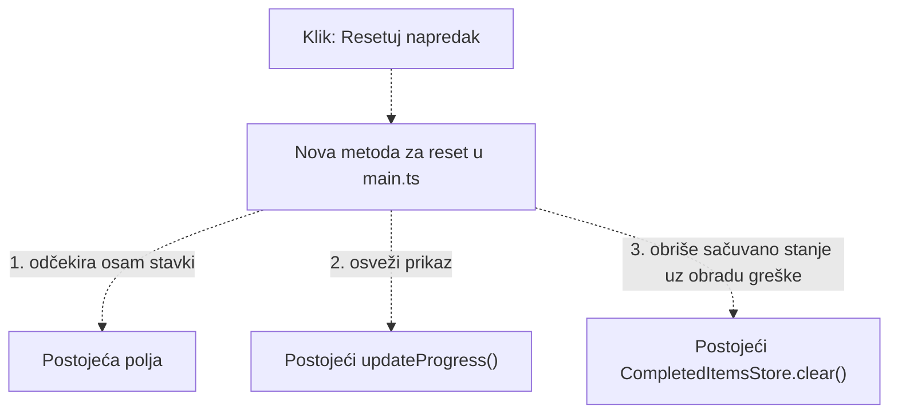

# Plan: dugme „Resetuj napredak”

Status: predlog za pregled i odobrenje; kod još nije menjan.

Pregledani su README.md, AGENTS.md, src/, public/index.html, public/styles.css,
postojeći testovi, podešavanja projekta i skripte. Prikaz napretka već radi kroz
`InterviewPreparationPage.updateProgress()`. Dugme `#reset-progress` postoji,
ali nema povezanu obradu klika. `CompletedItemsStore.clear()` već uklanja
ključ `priprema-za-intervju:completed-items` iz [`localStorage`][storage].
Specifikacija na putanji iz README-a nije pronađena ni pretragom nadređenog
foldera; ovaj predlog se zasniva na pregledanom kodu i zahtevima korisnika.

1. U `src/main.ts` pronaći i proveriti postojeće dugme kao `HTMLButtonElement`,
   sačuvati ga u klasi i u `start()` povezati imenovanu funkciju za obradu klika.
2. Dodati privatnu metodu za reset: odčekirati svih osam stavki, pozvati
   postojeći `updateProgress()` i obrisati sačuvano stanje kroz
   `this.completedItemsStore.clear()`. Ne pozivati `save([])`, jer ključ treba
   da bude uklonjen. Rezultat odmah mora biti `0 od 8 završeno`, `0%`, prazna
   traka i postojeća poruka `Počni pripremu`.
3. Obraditi eventualni neuspeh brisanja kroz `try`/`catch`, uz jasnu poruku u
   konzoli i bez neobrađenog izuzetka. Prikaz ostaje resetovan i u tom slučaju;
   ako pregledač odbije brisanje, uklanjanje sačuvanog stanja nije moguće
   garantovati i greška se ne sme prećutati.
4. U `tests/storage.test.ts` prilagoditi postojeću zamenu dugmeta i test koji
   sada očekuje neaktivan reset. Proveriti reset delimično i potpuno označenih
   stavki, ponovljeni reset, odsustvo ključa, očuvanje drugih sačuvanih ključeva,
   početno stanje pri ponovnom učitavanju i nastavak označavanja posle reseta.
   Proveriti i simulirani neuspeh brisanja, uz očuvanje postojećih provera napretka.
5. Pokrenuti `npm test` (uključuje proveru tipova) i `npm run build`, pa pregledati
   izmene. Ugovor i kod `src/storage.ts`, računanje u `src/progress.ts`, sadržaj
   stranice, tekstovi i stilovi ostaju nepromenjeni.

Predloženi tok (isprekidane veze tek treba implementirati):

[storage]: https://developer.mozilla.org/en-US/docs/Web/API/Window/localStorage
