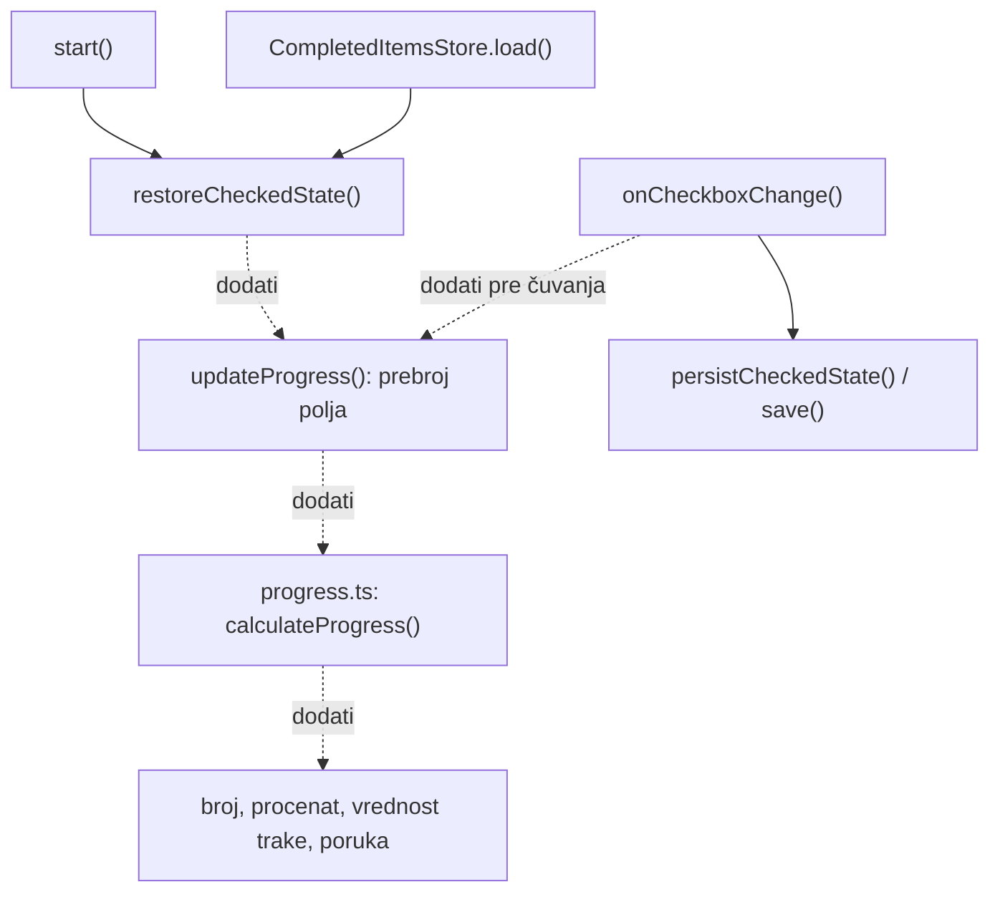

# Plan povezivanja trake napretka

## 1. Cilj i granice zadatka

Ovaj dokument je instrukcija za budućeg AI agenta. Sada se kreira samo `PLAN.md`; implementacija sledi tek kada korisnik zatraži izvršavanje plana.

Omogućiti da osam polja za potvrdu određuju broj završenih stavki, procenat, popunjenost trake i statusnu poruku. Prikaz mora biti tačan odmah po otvaranju stranice i nakon svakog označavanja ili uklanjanja oznake.

Koristiti postojeći [TypeScript][typescript] i infrastrukturu projekta. Ne dodavati tehnologije ili zavisnosti. Ne menjati `public/styles.css`, strukturu stranice, konfiguraciju, skripte ni postojeći ugovor čuvanja podataka. Dugme `Resetuj napredak` ostaje nepovezano: ne dodavati njegov obrađivač događaja i ne pozivati `clear()` radi resetovanja. Ovaj korisnikov zahtev ima prednost nad zadatkom resetovanja iz README.md.

## 2. Nalazi analize postojećih fajlova

| Fajl | Trenutno stanje i značaj za dogradnju |
| --- | --- |
| `src/main.ts` | Klasa `InterviewPreparationPage` pronalazi tačno osam polja preko `[data-prep-item]`. `start()` poziva `restoreCheckedState()` i registruje imenovani obrađivač `onCheckboxChange`, koji trenutno samo poziva `persistCheckedState()`. Nema računanja ni ažuriranja prikaza napretka. |
| `src/storage.ts` | `CompletedItemsStore` učitava i čuva listu identifikatora u [`localStorage`][storage], pod ključem `priprema-za-intervju:completed-items`. `parseCompletedItemIds()` prihvata [JSON][json] niz stringova, a za nedostajuće ili neispravne podatke vraća prazan niz. `clear()` postoji, ali se ne koristi u trenutnom main.ts. |
| `public/index.html` | Postoji osam polja, `prep-item-1` do `prep-item-8`, raspoređenih u tri grupe. Prikaz ima `#progress-text`, `#progress-percentage`, `#progress-bar` i `#progress-message`. Traka je izvorni [HTML element progress][progress] sa `max="8"` i `value="0"`. Poruka već ima `aria-live="polite"`. |
| `public/styles.css` | Postojeći [CSS][css] već određuje izgled i boju trake preko `accent-color`. Širina elementa je 100%; menja se njegova vrednost, a ne širina elementa. |
| `tests/storage.test.ts` | Testovi pokrivaju parsiranje sačuvanih podataka, uključujući neispravan sadržaj; ne pokrivaju prikaz stranice niti stvarne greške pristupa skladištu. |
| `package.json`, `tsconfig.json`, `tsconfig.build.json` | Postoje provera tipova, testovi i izgradnja. Obuhvaćeni su novi fajlovi u `src/` i `tests/`, pa za planirane dodatke nije potrebno menjati konfiguraciju. |
| `scripts/` | Postojeće skripte čiste izlaz, kopiraju statičke fajlove i služe generisani `dist/`. Nisu potrebne izmene. |

README.md upućuje na `../project-specification.md`, ali taj fajl nije na navedenoj putanji i nije pronađen pretragom u ovom workspace-u. AGENTS.md izričito pominje izvoz funkcije `calculateProgress`, ali njen kompletan potpis nije dostupan. Predloženi potpis, preciznost procenta i nove poruke u nastavku jesu odluke ovog plana, a ne provereni zahtevi nedostupne specifikacije. Ako specifikacija postane dostupna, pre implementacije proveriti odeljke 8 i 9 i uskladiti ugovor; resetovanje i dalje ostaje van opsega.

## 3. Pravila računanja i prikaza

Izvor istine je trenutno svojstvo `checked` svih osam polja u [DOM-u][dom]. Pri svakom ažuriranju ponovo prebrojati označena polja. Ne održavati nezavisan brojač preko `++` i `--`, jer bi mogao da se raziđe sa obnovljenim stanjem.

Procenat računati kao `completed / total * 100`, gde je `total` broj validiranih polja, odnosno 8. Plan koristi tačne korake od 12,5 procentnih poena, bez zaokruživanja na ceo broj. U tekstu koristiti decimalni zarez i izostaviti decimalu kada je rezultat ceo broj.

| Završeno | Tekst broja | Tekst procenta | Vrednost trake, uz max = 8 |
| --- | --- | --- | --- |
| 0 | 0 od 8 završeno | 0% | 0 |
| 1 | 1 od 8 završeno | 12,5% | 1 |
| 2 | 2 od 8 završeno | 25% | 2 |
| 3 | 3 od 8 završeno | 37,5% | 3 |
| 4 | 4 od 8 završeno | 50% | 4 |
| 5 | 5 od 8 završeno | 62,5% | 5 |
| 6 | 6 od 8 završeno | 75% | 6 |
| 7 | 7 od 8 završeno | 87,5% | 7 |
| 8 | 8 od 8 završeno | 100% | 8 |

Predložene statusne poruke: za 0 stavki `Počni pripremu` (postojeći tekst), za 1–7 stavki `Priprema je u toku`, a za 8 stavki `Priprema je završena`. Pri uklanjanju oznaka vratiti odgovarajuću poruku, uključujući prelaze 8 → 7 i 1 → 0.

## 4. Koraci buduće implementacije

1. **Izdvojiti čisto računanje u novi `src/progress.ts`.** Izvesti imenovanu funkciju `calculateProgress`. Predloženi ugovor je `calculateProgress(completed: number, total: number): Progress`, gde tip `Progress` ima numerička polja `completed`, `total` i `percentage`. `percentage` je broj, npr. 12.5, dok se decimalni zarez (12,5%) koristi samo pri prikazu. Funkcija nema pristup stranici ili skladištu i ne zahteva klasu. Prihvatati cele brojeve za koje važi `total > 0` i `0 <= completed <= total`; za nevalidan ulaz baciti opisni `Error`. Potpis uskladiti sa specifikacijom ako bude dostupna.
2. **Pronaći elemente prikaza u `InterviewPreparationPage`.** Dodati privatna polja za četiri postojeća elementa. U konstruktoru proveriti da tekstualni elementi jesu `HTMLElement`, a traka `HTMLProgressElement`. Za nedostajući ili pogrešan element koristiti postojeći `MissingElementError` sa konkretnim selektorom. Ne koristiti neproverene konverzije tipova.
3. **Dodati privatnu metodu `updateProgress()`.** Prebrojati označena polja, pozvati `calculateProgress` i iz istog rezultata ažurirati sva četiri elementa [DOM-a][dom]. Postaviti `textContent` za broj, procenat i poruku. Na traci postaviti `max` na ukupan broj i `value` na broj završenih stavki; ažurirati i njen rezervni tekst procenta. Ne postavljati procenat kao `value` dok je `max` jednak 8. Zadržati postojeće atribute pristupačnosti.
4. **Povezati početno prikazivanje.** U `start()` odmah nakon `restoreCheckedState()` pozvati `updateProgress()`, pre registracije slušalaca. Brojati obnovljena polja, ne dužinu učitane liste: nepoznati identifikatori i duplikati ne smeju uvećati rezultat.
5. **Povezati promene.** U postojećem imenovanom obrađivaču [`change` događaja][change] pozvati `updateProgress()` i sačuvati postojeći poziv `persistCheckedState()`. Tako klik, klik na oznaku polja i tastatura koriste isti tok. Ne dodavati drugi slušalac za isti posao. Prikaz ažurirati pre čuvanja, kako greška čuvanja ne bi ostavila staru vrednost trake.
6. **Obraditi greške u granicama izmene.** Pristup [`localStorage`][storage] kroz postojeće pozive može baciti grešku iako parsiranje neispravnog sadržaja ima rezervno ponašanje. Obrađivač promene hvata grešku iz `persistCheckedState()` i prijavljuje je pozivom `console.error`, uz kontekst `InterviewPreparationPage.onCheckboxChange: čuvanje stanja nije uspelo` i originalnu grešku. Ne baca novu grešku i ne vraća oznake niti prikaz napretka na prethodno stanje. Ne menjati `storage.ts`. Sačuvati postojeće prijavljivanje greške pokretanja; ne uvoditi novi sistem obaveštenja ili proširivati zadatak opštim refaktorisanjem.
7. **Dodati `tests/progress.test.ts` i izvršiti provere iz sledećeg odeljka.** Buduće ručne izmene ograničiti na `src/main.ts`, novi `src/progress.ts` i novi `tests/progress.test.ts`. Ne menjati postojeće testove čuvanja, README.md ili ostale fajlove. `dist/` sme biti regenerisan postojećom komandom, ali ga ne uređivati ručno.

Sve izmene koda moraju poštovati AGENTS.md: imenovane funkcije umesto streličastih i anonimnih, eksplicitni `private`/`public`, dokumentacija iznad funkcija i metoda, jednostavni izrazi, dva razmaka, dvostruki navodnici, tačka-zarez i zahtevani prazni redovi. Bez `any`, non-null tvrdnji ili neproverenih konverzija tipova. Zadržati postojeći način relativnog uvoza sa `.ts` nastavkom.

Pune veze na dijagramu već postoje; isprekidane veze predstavljaju dogradnju:

## 5. Provera i kriterijumi prihvatanja

Automatske testove napisati postojećim [Node test runner-om][node-test], bez novih alata. Proveriti svih devet redova tabele računanja, kao i odbijanje negativnih, razlomljenih, beskonačnih i `NaN` ulaza, nultog ukupnog broja i broja završenih većeg od ukupnog. Koristiti eksplicitno očekivane vrednosti, umesto ponavljanja formule implementacije u testu.

Pokrenuti `npm test` (već uključuje proveru tipova), zatim `npm start` za izgradnju i ručnu proveru. Postojeće [npm][npm] skripte su dovoljne; ako zavisnosti nisu instalirane, prethodno koristiti `npm ci`. Po završetku provere zaustaviti lokalni server.

Ručna provera u pregledaču:

- U čistom stanju prikaz je `0 od 8 završeno`, `0%`, prazna traka i `Počni pripremu`.
- Označavati svih osam stavki redom i proveriti svaki red tabele, uključujući punu traku i završnu poruku.
- Uklanjati oznake do nule i proveriti obrnuti tok; ponavljati promene istog polja i birati polja iz različitih grupa.
- Proveriti rad tastaturom i klikom na tekst oznake polja.
- Osvežiti stranicu sa tri označene stavke: odmah moraju biti prikazani obnovljene oznake, `3 od 8 završeno`, `37,5%`, odgovarajuća traka i poruka. Ponoviti sa svim označenim stavkama.
- U izolovanom test stanju preko razvojnih alata pregledača proveriti odsutan zapis, neispravan zapis, duplirane i nepoznate identifikatore u [`localStorage`][storage]. Neispravan zapis daje početno stanje; duplikati i nepoznati identifikatori ne povećavaju broj stvarno označenih polja. Za pripremu ovih scenarija ne implementirati resetovanje.
- Simulirati grešku čuvanja pri promeni polja: oznake i napredak ostaju ažurirani, konzola beleži kontekst `InterviewPreparationPage.onCheckboxChange: čuvanje stanja nije uspelo` i originalnu grešku, a obrađivač ne prosleđuje izuzetak.
- Klik na `Resetuj napredak` i dalje ne menja oznake, prikaz ili sačuvano stanje.
- Boja, širina spoljnog elementa, raspored i ostali stilovi ostaju isti. Konzola nema neočekivane greške pri normalnoj upotrebi.

Na kraju pregledati razlike fajlova i izvestiti šta je implementirano i koje su provere stvarno izvršene. Automatski test računanja ne predstavljati kao dokaz provere prikaza u pregledaču. Zadatak je završen kada svi prikazi prate stvarno stanje polja pri otvaranju i promenama, čuvanje i dalje radi, a resetovanje i stilovi ostanu netaknuti.

## Reference

[typescript]: https://www.typescriptlang.org/docs/
[storage]: https://developer.mozilla.org/en-US/docs/Web/API/Window/localStorage
[json]: https://developer.mozilla.org/en-US/docs/Web/JavaScript/Reference/Global_Objects/JSON
[progress]: https://developer.mozilla.org/en-US/docs/Web/HTML/Element/progress
[css]: https://developer.mozilla.org/en-US/docs/Web/CSS
[dom]: https://developer.mozilla.org/en-US/docs/Web/API/Document_Object_Model
[change]: https://developer.mozilla.org/en-US/docs/Web/API/HTMLElement/change_event
[node-test]: https://nodejs.org/docs/latest-v24.x/api/test.html
[npm]: https://docs.npmjs.com/about-npm
