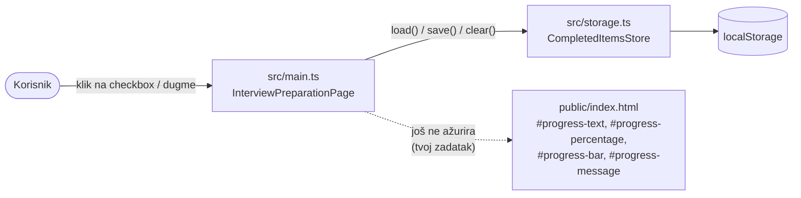
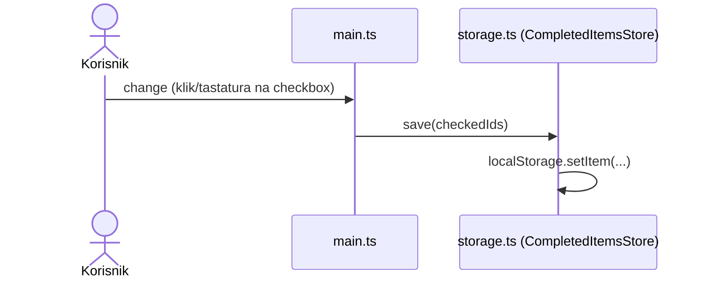
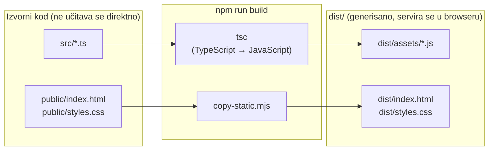

# Priprema za intervju

Mala lokalna veb-aplikacija koja kandidatu pomaže da prati napredak pripreme
za intervju: obeležava korake koje je završio, kroz tri grupe stavki, i vidi
koliko je ukupno napredovao.

Ovo je **trening ("starter") projekat**: HTML, CSS i čuvanje izabranih
stavki u [`localStorage`][mdn-localstorage] su već gotovi, ali prikaz
napretka (broj, procenat, traka i poruka) i dugme `Resetuj napredak` još
nisu povezani na logiku — to je zadatak koji treba dovršiti. Tačan opseg
zadatka, uključujući koji fajlovi nedostaju i koji ugovor moraju da ispune,
je u [`project-specification.md`](../project-specification.md) i u
nedeljnom zadatku koji ti je dat uz ovaj repozitorijum.

## Funkcionalnosti

Već radi:

- tri grupe pripremnih koraka (`Dokumenti`, `Istraživanje firme`, `Vežba odgovora`), ukupno osam stavki;
- izabrane stavke ostaju zapamćene i posle osvežavanja stranice ([`localStorage`][mdn-localstorage], vidi [`src/storage.ts`](./src/storage.ts));
- dugme `Resetuj napredak` je prikazano, ali još ne radi ništa.

Tvoj zadatak:

- broj i procenat završenih koraka, traka napretka i statusna poruka koja prati napredak (trenutno uvek pokazuju početno stanje, bez obzira na to šta je izabrano);
- da dugme `Resetuj napredak` stvarno vrati sve na početno stanje i očisti sačuvano stanje.

## Tehnologije

- [TypeScript][typescript], kompajliran u obično [ES modul][mdn-modules] [JavaScript][mdn-javascript] koji browser učitava direktno (`<script type="module">`), bez [bandlera][wiki-bundler] (npr. Webpack, Vite) ili [razvojnog okvira][mdn-frameworks] (npr. React, Angular);
- semantički [HTML][mdn-html] i obična [CSS][mdn-css] (bez [CSS okvira][wiki-css-framework] poput Bootstrap-a);
- [Node.js][nodejs] 24 LTS i ugrađeni [Node test runner][node-test] (`node:test`) za automatske testove;
- [`npm`][npm-docs] za instalaciju zavisnosti i pokretanje skripti iz `package.json`;
- nema runtime zavisnosti, backend-a, baze ili mrežnih poziva — sve radi lokalno u browseru.

## Struktura projekta

```text
priprema-za-intervju/
  package.json             zavisnosti i npm skripte
  package-lock.json        zaključane tačne verzije zavisnosti
  tsconfig.json            podešavanje provere tipova (za src/ i tests/)
  tsconfig.build.json      podešavanje kompajliranja u dist/
  public/
    index.html             HTML sadržaj stranice
    styles.css             stilovi
  src/
    main.ts                DOM ponašanje (event listeneri, prikaz)
    storage.ts             čuvanje izabranih stavki u localStorage
  tests/
    storage.test.ts        automatski testovi za storage.ts
  scripts/
    copy-static.mjs        kopira statičke fajlove za distribuciju u dist/
    clean.mjs              čisti sve fajlove iz dist/
    serve.mjs              lokalni HTTP server
  dist/                    generisani fajlovi za distribuciju; nikad se ne uređuje ručno
```

## Preduslovi

- Node.js 24 LTS.
- `npm` koji dolazi sa Node.js instalacijom.

## Komande

| Komanda | Šta radi |
| --- | --- |
| `npm ci` | Instalira tačne verzije zavisnosti iz `package-lock.json`. |
| `npm run typecheck` | Provera tipova za sav TypeScript kod (`src/` i `tests/`), bez generisanja fajlova. |
| `npm run build` | Briše stari `dist/`, kompajlira `src/` u `dist/assets/`, kopira `public/` u `dist/`. |
| `npm test` | Prvo provera tipova, zatim automatski testovi (`node:test`, bez mreže i bez browsera). |
| `npm start` | Sveži build, zatim pokreće lokalni server na `http://localhost:4173`, koji servira isključivo `dist/`. |

Tipičan tok rada:

```bash
npm ci
npm test
npm start
```

Zatim otvori adresu koju server ispiše u terminalu.

## Arhitektura

Dva TypeScript modula postoje danas, sa jasno odvojenim odgovornostima:

- `src/main.ts` čita [HTML][mdn-html] preko `data-prep-item` atributa i `id`
  vrednosti definisanih u `public/index.html`, sluša [`change`
  događaje][mdn-addeventlistener] na poljima za potvrdu i povezuje
  [DOM][mdn-dom] sa čuvanjem stanja. Prikaz napretka i dugme `Resetuj
  napredak` još nisu povezani na ništa — koji fajl(ovi) i koja logika
  nedostaju je opisano u `project-specification.md`, odeljak 4 i 9.
- `src/storage.ts` izvozi klasu `CompletedItemsStore`, koja čuva i čita
  [`JSON`][mdn-json] listu izabranih `id` vrednosti u
  [`localStorage`][mdn-localstorage]. Ovo je već gotovo i testirano
  (`tests/storage.test.ts`) — ne menjaj ovaj ugovor.

Sledeći dijagram prikazuje šta danas stvarno radi: pune linije su već
povezane, isprekidana linija je jedini deo DOM-a koji `main.ts` još ne
ažurira.



Sledeći dijagram prikazuje redosled poziva kada korisnik označi ili ukloni
oznaku sa stavke:



Ovo je učenje kroz čitanje koda, ne samo kroz tekst: otvori
[`src/main.ts`](./src/main.ts) i [`src/storage.ts`](./src/storage.ts) pored
ovih dijagrama i prati koja linija koda odgovara kojoj strelici.

### Od izvornog koda do stranice u browseru

Browser nikad ne učitava `.ts` fajlove direktno — učitava generisani
[JavaScript][mdn-javascript] iz `dist/assets/`. `npm run build` prevodi
(kompajlira) `src/*.ts` u `dist/assets/*.js` pomoću
[`tsc`][typescript-compiler-options] i kopira `public/index.html` i
`public/styles.css` u `dist/`.



Ako promeniš nešto u `src/` ili `public/`, potrebno je ponovo pokrenuti
`npm run build` (ili `npm start`, koji to radi automatski) da bi se promena
videla na stranici.

## Pojmovi i reference

Ako ti neki od ovih pojmova nije poznat, pogledaj autoritativan izvor pre
nego što tražiš od AI asistenta da ti objasni:

- [TypeScript][typescript] — programski jezik korišćen u `src/` i `tests/`.
- [JavaScript][mdn-javascript] — jezik u koji se TypeScript kompajlira i koji browser stvarno izvršava.
- [ES modul][mdn-modules] (ECMAScript module) — način na koji je `assets/main.js` učitan u `public/index.html` (`<script type="module">`).
- [DOM][mdn-dom] (Document Object Model) — stablo elemenata stranice sa kojim `src/main.ts` radi.
- [`addEventListener`][mdn-addeventlistener] — kako `main.ts` reaguje na `change` događaje na poljima za potvrdu.
- [`localStorage`][mdn-localstorage] — mehanizam koji `src/storage.ts` koristi za pamćenje izabranih stavki.
- [JSON][mdn-json] — format u kom su izabrane stavke zapisane unutar `localStorage`.
- [HTML][mdn-html] i [CSS][mdn-css] — jezici u `public/index.html` i `public/styles.css`.
- [Bandler (module bundler)][wiki-bundler] i [razvojni okvir (framework)][mdn-frameworks] — alati koje ovaj projekat namerno **ne** koristi (videti odeljak Tehnologije).
- [CSS okvir][wiki-css-framework] — kategorija alata (npr. Bootstrap) koju ovaj projekat namerno **ne** koristi.
- [Node.js][nodejs] i [`npm`][npm-docs] — okruženje i alat za pokretanje skripti van browsera (`npm test`, `npm start`, ...).
- [Node test runner][node-test] — ugrađeni alat kojim se pokreću `tests/*.test.ts`.
- [Kompajlerske opcije TypeScript-a][typescript-compiler-options] — objašnjenje podešavanja u `tsconfig.json` i `tsconfig.build.json`.

[typescript]: https://www.typescriptlang.org/
[typescript-compiler-options]: https://www.typescriptlang.org/docs/handbook/compiler-options.html
[mdn-javascript]: https://developer.mozilla.org/en-US/docs/Web/JavaScript
[mdn-modules]: https://developer.mozilla.org/en-US/docs/Web/JavaScript/Guide/Modules
[mdn-dom]: https://developer.mozilla.org/en-US/docs/Web/API/Document_Object_Model
[mdn-addeventlistener]: https://developer.mozilla.org/en-US/docs/Web/API/EventTarget/addEventListener
[mdn-localstorage]: https://developer.mozilla.org/en-US/docs/Web/API/Window/localStorage
[mdn-json]: https://developer.mozilla.org/en-US/docs/Web/JavaScript/Reference/Global_Objects/JSON
[mdn-html]: https://developer.mozilla.org/en-US/docs/Web/HTML
[mdn-css]: https://developer.mozilla.org/en-US/docs/Web/CSS
[mdn-frameworks]: https://developer.mozilla.org/en-US/docs/Learn_web_development/Core/Frameworks_libraries
[wiki-bundler]: https://en.wikipedia.org/wiki/Module_bundler
[wiki-css-framework]: https://en.wikipedia.org/wiki/CSS_framework
[nodejs]: https://nodejs.org/en/about
[npm-docs]: https://docs.npmjs.com/about-npm
[node-test]: https://nodejs.org/docs/latest-v24.x/api/test.html
