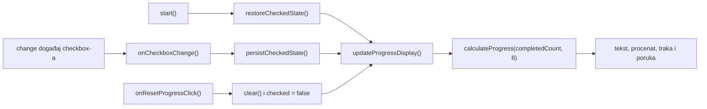

# Spec 00: Prikaz napretka

Status: implementirano i provereno na grani `tim-treca-smena`.

## Cilj

Prikaz napretka treba da pretvori trenutno stanje osam [checkbox-a][mdn-checkbox] za pripremu u četiri usklađena prikaza: tekstualni broj završenih stavki, procenat, vrednost trake napretka i statusnu poruku. Izračunavanje ostaje odvojeno od [DOM-a][mdn-dom], dok `InterviewPreparationPage` čita checkbox-e i upisuje rezultat u stranicu.

## Potpis i rezultat funkcije

U `src/main.ts` postoji sledeći tačan [TypeScript][typescript-functions] potpis:

```ts
export function calculateProgress(completedCount: number, totalCount: number): ProgressResult
```

`ProgressResult` sadrži tri `readonly` broja:

- `completedCount` — prosleđeni broj završenih stavki;
- `totalCount` — prosleđeni ukupan broj stavki;
- `percentage` — [`Math.round()`][mdn-math-round] primenjen na `(completedCount / totalCount) * 100`.

Funkcija je čista: ne čita niti menja stanje stranice. U stvarnom toku stranice poziva se sa `TOTAL_ITEMS`, čija je vrednost `8`.

## Gde i kako se funkcija poziva

Jedino produkciono mesto poziva je metod:

```ts
private updateProgressDisplay(): void
```

Metod prolazi kroz `this.checkboxes`, čita njihovo [`.checked` stanje][mdn-checked], izračunava `completedCount`, a zatim poziva:

```ts
const progress = calculateProgress(completedCount, TOTAL_ITEMS);
```

`updateProgressDisplay()` se u finalnom kodu poziva na tri mesta:

1. U `public start(): void`, odmah posle `restoreCheckedState()`, kako bi prikaz odgovarao stanju vraćenom iz [localStorage-a][mdn-local-storage].
2. U named handler-u `onCheckboxChange(): void`, odmah posle `persistCheckedState()`, kako bi svaka korisnička promena checkbox-a osvežila prikaz.
3. U named handler-u `onResetProgressClick(): void`, pošto je reset obrisao sačuvano stanje i poništio sve checkbox-e.



## Elementi koji se ažuriraju

`private findProgressElements(): ProgressElements` pronalazi i proverava četiri obavezna elementa. `updateProgressDisplay()` ih ažurira ovako:

| Element | Upisana vrednost |
| --- | --- |
| `#progress-text` | `` `${progress.completedCount} od ${progress.totalCount} završeno` `` |
| `#progress-percentage` | `` `${progress.percentage}%` `` |
| [`#progress-bar` `<progress>` element][mdn-progress] | `.value = progress.completedCount` |
| `#progress-message` | `this.getProgressMessage(progress)` |

Za početno stanje rezultat je `0 od 8 završeno`, `0%` i numerička vrednost trake `0`.

## Statusne poruke

Tačna imena i potpisi metoda koji učestvuju u izboru i prikazu poruke su:

```ts
private updateProgressDisplay(): void
private getProgressMessage(progress: ProgressResult): string
```

`getProgressMessage()` vraća tačno sledeće tekstove:

| Stanje | Uslov u kodu | Tekst |
| --- | --- | --- |
| Nema završenih stavki | `completedCount === 0` | `Počni pripremu` |
| Sve stavke su završene | `completedCount === totalCount` | `Priprema je završena` |
| Delimičan napredak | svi ostali slučajevi | `Samo napred, priprema je u toku` |

## Izvršena provera

Pokrenut je [`npm test`][npm-test]. Provera tipova je prošla, a svih 7 postojećih testova je uspešno. Postojeći `tests/progress.test.ts` posebno potvrđuje da `calculateProgress(1, 8)` zaokružuje procenat na `13`, a ne na `12`. Tokom implementacije reset dugmeta `calculateProgress`, `updateProgressDisplay()`, `getProgressMessage()` i `onCheckboxChange()` nisu menjani.

## Referentni izvori

[mdn-checkbox]: https://developer.mozilla.org/en-US/docs/Web/HTML/Reference/Elements/input/checkbox
[mdn-checked]: https://developer.mozilla.org/en-US/docs/Web/API/HTMLInputElement/checked
[mdn-dom]: https://developer.mozilla.org/en-US/docs/Web/API/Document_Object_Model
[mdn-local-storage]: https://developer.mozilla.org/en-US/docs/Web/API/Window/localStorage
[mdn-math-round]: https://developer.mozilla.org/en-US/docs/Web/JavaScript/Reference/Global_Objects/Math/round
[mdn-progress]: https://developer.mozilla.org/en-US/docs/Web/HTML/Reference/Elements/progress
[npm-test]: https://docs.npmjs.com/cli/v11/commands/npm-test/
[typescript-functions]: https://www.typescriptlang.org/docs/handbook/2/functions.html

## Checklist kriterijuma prihvatanja

- [x] Postoji eksportovana funkcija `calculateProgress(completedCount: number, totalCount: number): ProgressResult`.
- [x] Funkcija vraća prosleđene brojeve stavki i procenat zaokružen pomoću `Math.round`.
- [x] `updateProgressDisplay()` prebrojava trenutno čekirane stavke i poziva `calculateProgress`.
- [x] Prikaz se osvežava pri pokretanju, posle vraćanja sačuvanog stanja.
- [x] Prikaz se osvežava posle promene checkbox-a, bez dupliranja računanja.
- [x] Ažuriraju se `#progress-text`, `#progress-percentage`, `#progress-bar.value` i `#progress-message`.
- [x] Početno stanje prikazuje `0 od 8 završeno`, `0%`, vrednost trake `0` i `Počni pripremu`.
- [x] Tekstovi za početno, delimično i završeno stanje odgovaraju stvarnim tekstovima u kodu.
- [x] Postojeći test za `calculateProgress` i kompletan `npm test` prolaze.
