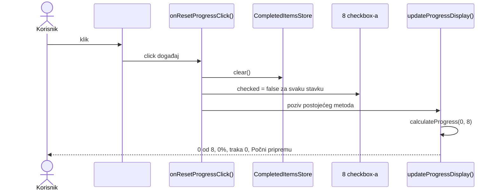

# Spec 01: Reset dugme

Status: implementirano i provereno na grani `tim-treca-smena`.

## Cilj

Klik na dugme `#reset-progress` treba jednim postupkom da obriše sačuvano stanje, poništi svih osam `[data-prep-item]` [checkbox-a][mdn-checkbox] u [DOM-u][mdn-dom] i vrati ceo prikaz napretka na početne vrednosti:

- `#progress-text`: `0 od 8 završeno`;
- `#progress-percentage`: `0%`;
- `#progress-bar.value`: `0`;
- `#progress-message`: `Počni pripremu`.

## Polazno stanje utvrđeno pregledom

Pre implementacije je pregledan ceo `src/main.ts`, pravila iz `AGENTS.md` i odgovarajući deo `public/index.html`. Utvrđeno je sledeće stvarno stanje:

- `InterviewPreparationPage` već poseduje niz od tačno osam checkbox-a u `this.checkboxes`.
- `CompletedItemsStore` već nudi `public clear(): void`, koji uklanja samo ključ `priprema-za-intervju:completed-items` iz [localStorage-a][mdn-local-storage].
- `private updateProgressDisplay(): void` već iz checkbox-a izvodi kompletno stanje prikaza.
- `public start(): void` već koristi named funkciju `onCheckboxChange(): void` i `const page = this`, bez arrow funkcije.
- [HTML][mdn-html] već sadrži `<button id="reset-progress" type="button">Resetuj napredak</button>`.
- Dugme nije imalo vezan `click` handler.

Ovo je omogućilo malu izmenu koja ponovo koristi postojeće skladište, listu checkbox-a i mehanizam prikaza.

## Tok od analize do konačnog rešenja

### 1. Sačuvan je postojeći izvor istine

Prikaz se već izračunava iz [`.checked` stanja checkbox-a][mdn-checked]. Zato reset ne upisuje posebno tekst, procenat, vrednost trake niti poruku. Jedini izvor istine ostaje trenutni [DOM][mdn-dom], a postojeći `updateProgressDisplay()` ponovo iz njega izvodi rezultat.

Time nisu menjani `calculateProgress`, `getProgressMessage()` ni postojeći `onCheckboxChange()`.

### 2. Izabran je handler koji prati postojeći obrazac

Implementiran je sledeći tačan [TypeScript][typescript-functions] handler:

```ts
function onResetProgressClick(): void
```

Handler je named funkcija definisana unutar `public start(): void`. Koristi već postojeći `const page = this`, isto kao `onCheckboxChange()`. Tako se zadržava ispravan kontekst instance bez arrow funkcije, anonimnog callback-a, cast-a ili non-null assertion-a.

Na dugme je vezan pozivom standardnog [`addEventListener()`][mdn-add-event-listener] mehanizma:

```ts
this.resetButton.addEventListener("click", onResetProgressClick);
```

### 3. Dugme je uključeno u proveru strukture stranice

U klasu je dodat član:

```ts
private readonly resetButton: HTMLButtonElement;
```

Konstruktor ga inicijalizuje rezultatom novog metoda:

```ts
private findResetButton(): HTMLButtonElement
```

Metod koristi [`document.getElementById("reset-progress")`][mdn-get-element-by-id] i proverava `instanceof HTMLButtonElement`. Ako element ne postoji ili nije `<button>`, izvršava se:

```ts
throw new MissingElementError("'#reset-progress' <button> element");
```

Time se pokretanje stranice sa nedostajućim ili pogrešnim dugmetom prekida istim obrascem koji već koriste `findCheckboxes()` i `findProgressElements()`.

### 4. Utvrđen je tačan redosled promene stanja

Unutar `onResetProgressClick(): void` operacije se izvršavaju ovim redom:

1. `page.completedItemsStore.clear()` briše sačuvani ključ.
2. Petlja prolazi kroz `page.checkboxes` i svakom elementu postavlja `checkbox.checked = false`.
3. `page.updateProgressDisplay()` ponovo izračunava i iscrtava prikaz.

Brisanje skladišta je prvo, pa neuspeh te operacije ne ostavlja [DOM][mdn-dom] privremeno resetovan uz staro sačuvano stanje. `persistCheckedState()` se namerno ne poziva: posle `clear()` bi ponovo napravio ključ sa vrednošću `[]`. Programsko postavljanje [`.checked` svojstva][mdn-checked] ne uvodi novu putanju kroz postojeći checkbox handler.

### 5. Ponovno je upotrebljen postojeći prikaz

Posle poništavanja checkbox-a `updateProgressDisplay()` prebrojava nula čekiranih stavki i poziva `calculateProgress(0, 8)`. Postojeća logika zatim postavlja broj, procenat i traku, dok `getProgressMessage()` za nula završenih stavki vraća `Počni pripremu`.



### 6. Potvrdni dijalog nije dodat

[`window.confirm()`][mdn-confirm] nije deo implementacije. Zahtev definiše neposredan reset na klik, dok bi dijalog uveo dodatnu granu u kojoj klik ne resetuje stanje. Izostavljanje dijaloga zato čuva precizan ugovor zadatka.

### 7. Izabrana je provera primerena postojećem projektu

Nije dodat [DOM][mdn-dom] test jer projekat nema takvo test okruženje ni odgovarajuću zavisnost, a zadatak zabranjuje dodavanje zavisnosti. Umesto krhkog ručno napravljenog lažnog browsera, izvršene su sledeće provere:

- [`npm test`][npm-test], koji uključuje strogu proveru tipova;
- svih 7 postojećih testova, uključujući test za `calculateProgress` i testove skladišta;
- pregled finalnog diff-a i redosleda operacija;
- provera da `calculateProgress`, `onCheckboxChange()` i `src/storage.ts` nisu menjani.

Rezultat `npm test`: 7 testova je prošlo, 0 nije prošlo.

## Konačno ponašanje

Tok reseta u finalnom kodu je:

```text
klik → clear() → svi checkbox-i unchecked → updateProgressDisplay()
```

Nakon osvežavanja stranice prethodno čekirane stavke se ne vraćaju, zato što `clear()` uklanja ključ umesto da čuva praznu listu.

## Ručna provera u browseru

1. Pokrenuti [`npm start`][npm-start] i otvoriti prikazanu lokalnu adresu.
2. Čekirati nekoliko stavki i proveriti da prikaz pokazuje odgovarajući delimičan napredak.
3. Kliknuti `Resetuj napredak`.
4. Proveriti da nijedan `[data-prep-item]` checkbox nije čekiran.
5. Proveriti tekst `0 od 8 završeno`, procenat `0%`, numeričku vrednost trake `0` i poruku `Počni pripremu`.
6. Osvežiti stranicu i proveriti da se prethodne stavke ne vraćaju.
7. U browser konzoli proveriti da [`localStorage`][mdn-local-storage] poziv `getItem("priprema-za-intervju:completed-items")` vraća `null`.

## Referentni izvori

[mdn-add-event-listener]: https://developer.mozilla.org/en-US/docs/Web/API/EventTarget/addEventListener
[mdn-checkbox]: https://developer.mozilla.org/en-US/docs/Web/HTML/Reference/Elements/input/checkbox
[mdn-checked]: https://developer.mozilla.org/en-US/docs/Web/API/HTMLInputElement/checked
[mdn-confirm]: https://developer.mozilla.org/en-US/docs/Web/API/Window/confirm
[mdn-dom]: https://developer.mozilla.org/en-US/docs/Web/API/Document_Object_Model
[mdn-get-element-by-id]: https://developer.mozilla.org/en-US/docs/Web/API/Document/getElementById
[mdn-html]: https://developer.mozilla.org/en-US/docs/Web/HTML
[mdn-local-storage]: https://developer.mozilla.org/en-US/docs/Web/API/Window/localStorage
[npm-start]: https://docs.npmjs.com/cli/v11/commands/npm-start/
[npm-test]: https://docs.npmjs.com/cli/v11/commands/npm-test/
[typescript-functions]: https://www.typescriptlang.org/docs/handbook/2/functions.html

## Checklist kriterijuma prihvatanja

- [x] Postoji named handler `onResetProgressClick(): void` vezan za klik na `#reset-progress`.
- [x] Handler poziva `CompletedItemsStore.clear()`.
- [x] Handler postavlja svih osam `[data-prep-item]` checkbox-a na unchecked u DOM-u.
- [x] Handler ponovo poziva postojeći `updateProgressDisplay()` bez nove logike za prikaz.
- [x] Posle reseta prikaz daje `0 od 8 završeno`, `0%`, `progress-bar.value = 0` i `Počni pripremu`.
- [x] `findResetButton()` baca `MissingElementError` ako `#reset-progress` ne postoji ili nije `<button>`.
- [x] `calculateProgress`, `onCheckboxChange()` i `src/storage.ts` nisu menjani.
- [x] Postojeći test za `calculateProgress` i testovi skladišta prolaze bez izmena.
- [x] Pokrenut je `npm test`: typecheck i svih 7 testova prolaze.
- [x] `specs/spec-00-progress-bar.md` opisuje stvarni postojeći prikaz napretka.
- [x] `specs/spec-01-reset-button.md` opisuje stvarni tok implementacije i konačno reset ponašanje.
